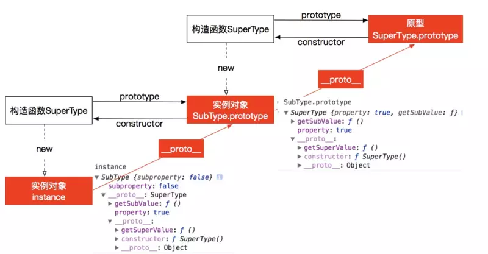
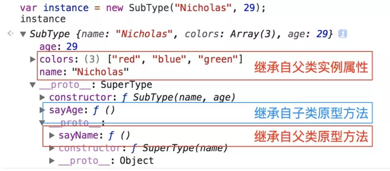

# ES5 实现继承

### 1.类式继承(原型链继承)

构造函数、原型和实例之间的关系：每个构造函数都有一个原型对象，原型对象都包含一个指向构造函数的指针，而实例都包含一个原型对象的指针。

继承的本质就是**复制，即重写原型对象**，代之以一个新类型的实例。

```JavaScript
function SuperType() {
    this.property = true;
}

SuperType.prototype.getSuperValue = function() {
    return this.property;
}

function SubType() {
    this.subproperty = false;
}

// 这里是关键，创建SuperType的实例，并将该实例赋值给SubType.prototype
SubType.prototype = new SuperType(); 

SubType.prototype.getSubValue = function() {
    return this.subproperty;
}

var instance = new SubType();
console.log(instance.getSuperValue()); // true
```



**缺点**：多个实例对引用类型的操作会被篡改。

### 2.构造函数继承

使用父类的构造函数来增强子类实例，等同于复制父类的实例给子类（不使用原型）

```JavaScript
function SuperType(){
    this.color=['red', 'green', 'blue'];
}

function SubType(){
    //继承自SuperType
    SuperType.call(this);
}

var instance1 = new SubType();
instance1.color.push('black');
alert(instance1.color); // "red,green,blue,black"

var instance2 = new SubType();
alert(instance2.color); // "red,green,blue"
```

核心代码是 `SuperType.call(this)`，创建子类实例时调用 `SuperType` 构造函数，将子类中的变量在父类中执行了一遍,由于父类中是给 `this` 绑定属性的,因此子类自然也就继承了父类的共有属性。
 
由于这种类型的继承没有涉及原型 `prototype`,所以父类的原型方法自然不会被子类继承,而如果想被子类继承就必须要放在构造函数中,这样创建出来的每个实例都会单独拥有一份而不能共用,这就违背了代码复用的原则

**缺点**：
- 只能继承父类的实例属性和方法，不能继承原型属性/方法
- 无法实现复用，每个子类都有父类实例函数的副本，影响性能

### 3.组合继承

组合上述两种方法就是组合继承。用原型链实现对原型属性和方法的继承，用借用构造函数技术来实现实例属性的继承。


```JavaScript
function SuperType(name){
  this.name = name;
  this.colors = ["red", "blue", "green"];
}
SuperType.prototype.sayName = function(){
  alert(this.name);
};

function SubType(name, age){
  // 继承属性
  // 第二次调用SuperType()
  SuperType.call(this, name);
  this.age = age;
}

// 继承方法
// 构建原型链
// 第一次调用SuperType()
SubType.prototype = new SuperType(); 
// 重写SubType.prototype的constructor属性，指向自己的构造函数SubType
SubType.prototype.constructor = SubType; 
SubType.prototype.sayAge = function(){
    alert(this.age);
};

var instance1 = new SubType("Nicholas", 29);
instance1.colors.push("black");
alert(instance1.colors); //"red,blue,green,black"
instance1.sayName(); //"Nicholas";
instance1.sayAge(); //29

var instance2 = new SubType("Greg", 27);
alert(instance2.colors); //"red,blue,green"
instance2.sayName(); //"Greg";
instance2.sayAge(); //27
```


**缺点**：

* 第一次调用 `SuperType()`：给 `SubType.prototype` 写入两个属性 `name`，`color`。
* 第二次调用 `SuperType()`：给 `instance1` 写入两个属性 `name`，`color`。

实例对象 `instance1` 上的两个属性就屏蔽了其原型对象 `SubType.prototype` 的两个同名属性。所以，组合模式的缺点就是在使用子类创建实例对象时，其原型中会存在两份相同的属性/方法。

### 4.原型式继承

利用一个空对象作为中介，将某个对象直接赋值给空对象构造函数的原型。

```JavaScript
function object(obj){
  function F(){}
  F.prototype = obj;
  return new F();
}
```

`object()` 对传入其中的对象执行了一次浅复制，将构造函数F的原型直接指向传入的对象。

```JavaScript
var person = {
  name: "Nicholas",
  friends: ["Shelby", "Court", "Van"]
};

var anotherPerson = object(person);
anotherPerson.name = "Greg";
anotherPerson.friends.push("Rob");

var yetAnotherPerson = object(person);
yetAnotherPerson.name = "Linda";
yetAnotherPerson.friends.push("Barbie");

alert(person.friends);   //"Shelby,Court,Van,Rob,Barbie"
```

**缺点**：
- 原型链继承多个实例的引用类型属性指向相同，存在篡改的可能。
- 无法传递参数

另外，ES5中存在 `Object.create()` 的方法，能够代替上面的 `object` 方法。

### 5.寄生式继承

核心：在原型式继承的基础上，增强对象，返回构造函数

```JavaScript
function createAnother(original){
  var clone = object(original); // 通过调用 object() 函数创建一个新对象
  clone.sayHi = function(){  // 以某种方式来增强对象
    alert("hi");
  };
  return clone; // 返回这个对象
}
```

函数的主要作用是为构造函数新增属性和方法，以增强函数;

```JavaScript
var person = {
  name: "Nicholas",
  friends: ["Shelby", "Court", "Van"]
};
var anotherPerson = createAnother(person);
anotherPerson.sayHi(); //"hi"
```

**缺点**（同原型式继承）：
- 原型链继承多个实例的引用类型属性指向相同，存在篡改的可能。
- 无法传递参数

### 6.寄生组合式继承

结合借用构造函数传递参数和寄生模式实现继承

```JavaScript
function inheritPrototype(subType, superType){
  var prototype = Object.create(superType.prototype); // 创建对象，创建父类原型的一个副本
  prototype.constructor = subType;                    // 增强对象，弥补因重写原型而失去的默认的constructor 属性
  subType.prototype = prototype;                      // 指定对象，将新创建的对象赋值给子类的原型
}

// 父类初始化实例属性和原型属性
function SuperType(name){
  this.name = name;
  this.colors = ["red", "blue", "green"];
}
SuperType.prototype.sayName = function(){
  alert(this.name);
};

// 借用构造函数传递增强子类实例属性（支持传参和避免篡改）
function SubType(name, age){
  SuperType.call(this, name);
  this.age = age;
}

// 将父类原型指向子类
inheritPrototype(SubType, SuperType);

// 新增子类原型属性
SubType.prototype.sayAge = function(){
  alert(this.age);
}

var instance1 = new SubType("xyc", 23);
var instance2 = new SubType("lxy", 23);

instance1.colors.push("2"); // ["red", "blue", "green", "2"]
instance1.colors.push("3"); // ["red", "blue", "green", "3"]
```



这个例子的高效率体现在它只调用了一次 `SuperType` 构造函数，并且因此避免了在 `SubType.prototype` 上创建不必要的、多余的属性。于此同时，原型链还能保持不变；因此，还能够正常使用 `instanceof` 和 `isPrototypeOf()`。

这是最成熟的方法，也是现在库实现的方法。

### 7.混入方式继承多个对象

```JavaScript
function MyClass() {
     SuperClass.call(this);
     OtherSuperClass.call(this);
}

// 继承一个类
MyClass.prototype = Object.create(SuperClass.prototype);
// 混合其它
Object.assign(MyClass.prototype, OtherSuperClass.prototype);
// 重新指定constructor
MyClass.prototype.constructor = MyClass;

MyClass.prototype.myMethod = function() {
     // do something
};
```

`Object.assign` 会把 `OtherSuperClass` 原型上的函数拷贝到 `MyClass` 原型上，使 `MyClass` 的所有实例都可用 `OtherSuperClass` 的方法。

### 8.ES6类继承 extends 

`extends` 关键字主要用于类声明或者类表达式中，以创建一个类，该类是另一个类的子类。其中 `constructor` 表示构造函数，一个类中只能有一个构造函数，有多个会报出`  `SyntaxError` 错误,如果没有显式指定构造方法，则会添加默认的 `constructor` 方法，使用例子如下。

`extends` 继承的核心代码如下，其实现和上述的寄生组合式继承方式一样:

```JavaScript
function _inherits(subType, superType) {
  
    // 创建对象，创建父类原型的一个副本
    // 增强对象，弥补因重写原型而失去的默认的constructor 属性
    // 指定对象，将新创建的对象赋值给子类的原型
    subType.prototype = Object.create(superType && superType.prototype, {
        constructor: {
            value: subType,
            enumerable: false,
            writable: true,
            configurable: true
        }
    });
    
    if (superType) {
        Object.setPrototypeOf 
            ? Object.setPrototypeOf(subType, superType) 
            : subType.__proto__ = superType;
    }
}
```
